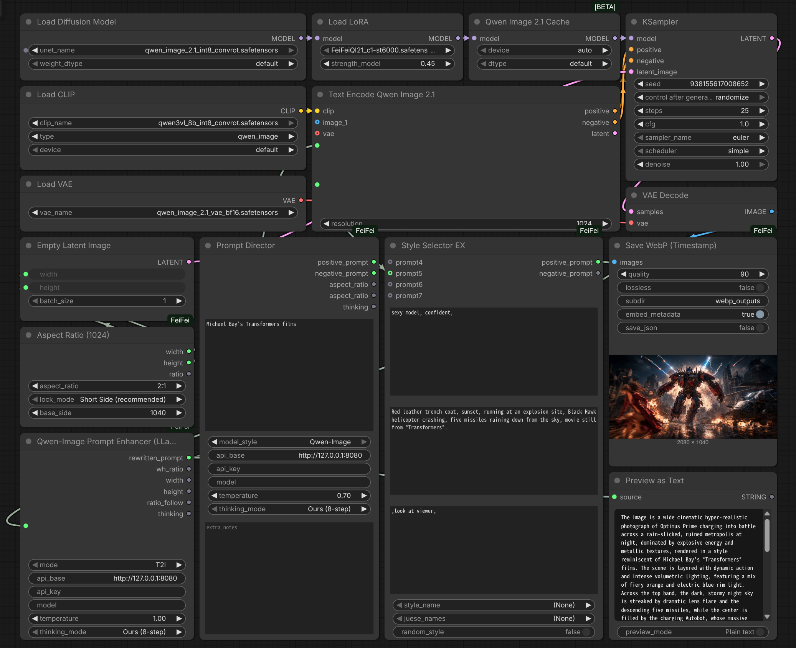

# ComfyUI-FeiFei

FeiFei's ComfyUI custom nodes (`CATEGORY = FeiFei`): LLM-driven Prompt Director, prompt enhancing, image captioning, aspect-ratio sizing, style/character template assembly, watermark, format conversion, WebP save/load.



### Example workflow

The screenshot above comes with the full workflow JSON: [`Workflow/ComfyUI-FeiFei.json`](Workflow/ComfyUI-FeiFei.json). Download it and drag-and-drop onto the ComfyUI canvas to load (missing custom nodes will show as red boxes if you haven't installed this pack).

## Install

```bash
cd ComfyUI/custom_nodes
git clone https://github.com/aifeifei798/ComfyUI-FeiFei.git
# Restart ComfyUI, nodes appear under the FeiFei category
```

Requirements: stock ComfyUI `torch / numpy / Pillow` plus `openai>=1.40` (see `requirements.txt`). If `openai` is missing, LLM calls automatically fall back to the standard library — the pack still imports and runs.

## Nodes

| Node | File | Notes |
|---|---|---|
| Prompt Director | `prompt_director_node.py` | Type a few minimal keywords (e.g. "cyberpunk, rainy night, red-haired girl"); an LLM director expands them into a ready-to-use shot. Outputs `positive_prompt` (subject + scene + mood + camera/lighting merged), `negative_prompt`, and `aspect_ratio` (clamped to the Aspect Ratio node's whitelist — convert that node's widget to input and connect it). `model_style` switches prompt dialect: **Flux** natural language / **SDXL** comma tags / **Qwen-Image** bilingual prose. Supports `api_key` + cloud APIs |
| Qwen-Image Prompt Enhancer (LLaMA) | `qwen_prompt_node.py` | Prompt rewriting via OpenAI-compatible API (llama.cpp `:8080` by default). Inputs: `api_base` / `api_key` / `model` / `temperature` / `thinking_mode`. Outputs rewritten prompt + ratio + size + `thinking`. `/v1/chat/completions` with `/completion` fallback, T2I / I2I system prompts |
| Image Captioner | `image_caption_node.py` | Upload image → vision model writes Chinese description + English prompt. **Requires a vision model behind the API** (e.g. Qwen-VL / MiniCPM-V); `max_side` caps upload size (default 1024). `api_key` supported |
| Aspect Ratio (1024) | `aspect_ratio_node.py` | No more megapixel math: pick ratio + lock mode (Short Side / Fixed Width / Fixed Height) + base side (default 1024), outputs 16-aligned width/height straight into Empty Latent. Its `aspect_ratio` widget accepts a connected ratio string (e.g. from Prompt Director) after Convert to input |
| Watermark | `watermark_node.py` | Three-line bottom-right watermark, per-line font size, white text with black stroke, cross-platform font lookup (`FEIFEI_FONT_PATH` first) |
| Film Grain & Tone | `film_grain_node.py` | Physical film post-processing, pure torch with no external models. **Sits after your sampler, before the watermark.** Organic grain + halation + lens chromatic aberration + print curve + micro-contrast |
| Image To RGB (Force 3-Channel) | `image_to_rgb.py` | Forces 3-channel RGB + `contiguous()`, tolerates NCHW / grayscale / RGBA, for picky downstream nodes (e.g. NVIDIA RTX VSR) |
| Style Selector EX | `style_selector_node_zh_ex.py` | prompt1/2/3 text boxes + **four extra input sockets `prompt4`~`prompt7`** (link-only, appended after the boxes) → character template (`juese_data.py`) → style template (`style_data.py`), optional random style. Add styles/characters by editing the two data files |
| Save WebP (Timestamp) | `ComfyUI_SaveWebP/save_webp_node.py` | Timestamped WebP (millisecond + index, no overwrites). **Prompt + seeds auto-saved to EXIF + sidecar `.json`** (below); `lossless`, `embed_metadata` / `save_json` toggles |
| Load WebP Info | same | Reads back prompt/seeds: sidecar JSON first, EXIF fallback. Outputs positive / negative / seeds / info_json |

Shared LLM helpers (`_post_chat_completions`, thinking-mode constants, JSON extraction, base-URL normalization) live in `llm_common.py` so the LLM nodes don't depend on each other.

## LLM access: openai SDK first, urllib fallback

- LLM nodes take an `api_key` input; leave it empty to read the `OPENAI_API_KEY` environment variable. Local llama.cpp needs neither.
- `api_base` accepts a host root (`http://127.0.0.1:8080`) or a full `/v1` URL — it is normalized automatically, so cloud endpoints (OpenAI / DeepSeek / Moonshot / any OpenAI-compatible server) work the same way.
- Requests go through the official `openai` Python SDK when installed (with retries and auth handled for you). If the SDK is missing or fails to initialize, the node falls back to standard-library `urllib` with an `Authorization` header — a broken proxy env or missing package never kills the pack.
- Cloud APIs require filling the `model` input (leave empty only for llama.cpp-style servers that ignore it).

## thinking_mode (Qwen + Captioner + Prompt Director)

| Mode | System prompt | `enable_thinking` | Measured (same prompt) |
|---|---|---|---|
| `Ours (8-step)` (default) | Full 8-step file / instruction box | false | ~1600 chars content |
| `Model native` | Built-in minimal prompt (JSON keys only) | true | ~550 chars content |
| `Both` | Full prompt / instruction box | true | For future Qwen3-class models |

If the server rejects `enable_thinking` with 400, the node retries once without it. Old workflows pick up the default mode, no changes needed.

## Film Grain & Tone (physical film post-processing)

Takes the "too clean, too plastic" look off AI images. No external models, torch only, about 0.2s at 1024² and 10ms at 4K on CUDA.

The stages run in the order a real film does: **lens** (vignette / lateral chromatic aberration) → **film base** (halation) → **print** (S-curve / split tone / micro-contrast) → **emulsion** (grain). Grain goes last so the print curve can't crush it.

Sits between `VAEDecode` and `Watermark`.

### Choosing: `mode` / `film_type` / `preset` / `preset_gain`

`mode` is a hard switch, not a blend. Preset and custom never mix.

| `mode` | Who drives the look |
|---|---|
| `Preset` (default) | The stock in `preset` decides every effect. **All sliders are ignored**; `preset_gain` sets how strong it is. |
| `Custom` | The sliders decide everything. **`film_type`, `preset` and `preset_gain` are ignored.** |

There is deliberately no in-between state: with a per-parameter mix factor it is never clear whether a slider you moved actually did anything. The sliders stay visible in `Preset` mode because ComfyUI cannot hide widgets, so they simply have no effect there.

`preset_gain` scales the seven effect amounts (grain, halation, vignette, print curve, micro-contrast, split tone, colour fringing) together and leaves the stock's own character alone (grain size, shadow bias, glow threshold). So `0.5` is a half-strength Tri-X rather than half of Tri-X's parameters, and `0.0` leaves the image untouched.

`film_type` only groups the `preset` list. **It applies no effect of its own.**

`preset` only changes the film's *character* (grain size, tonal response, halation tint, lens falloff) and **never applies a colour grade**, so your image keeps its own colours, it just looks like it was shot on film.

If you change `film_type` without changing `preset`, the node falls back to the first stock of the new family, so switching families never silently appears to do nothing.

Widgets are ordered by how you use them: `mode` first, then `film_type` / `preset` / `preset_gain` as one group, then the five main sliders, then `seed`. The fine-tuning inputs sit in the optional section, grouped by pipeline stage.

> `preset_mix` was replaced by `mode` and `preset_gain`, and the widgets were reordered, so a workflow saved before this version needs its film node re-picked once.

> Every widget has a tooltip explaining what breaks at which value (e.g. `grain_amount` past 0.6 starts looking like TV snow).

| film_type | Stocks |
|---|---|
| Color Negative | Portra 160 / 400 / 800, Ektar 100 / 500, Gold 200 / 400, Fuji C200, Pro 400H |
| Slide | Ektachrome E100, Fuji Provia 100F |
| B&W Negative | Tri-X 400, HP5 Plus 400, FP4 Plus 125, TMax 100 / 400, Delta 100 / 3200, Acros 100 |
| Cinema | CineStill 400D / 800T, Vision3 250D / 500T, Cine 50D, 500T Expired |
| Special | Cinestack 800T, Push +2 Stops, Cross Process |
| Other | Digital Clean (adds almost nothing, handy as an A/B baseline) |

Each stock only declares the traits that differ from a shared "normal negative" baseline, so tuning one film never shifts the others.

### Main sliders

Read in `Custom` mode, ignored in `Preset` mode.

| Widget | Default | Notes |
|---|---|---|
| `grain_amount` | 0.25 | Grain strength. Default is about ±3.5/255; 1.0 is about ±14/255. **Past that it reads as TV snow, not film** |
| `grain_size` | 1.0 | Clump size, scaled automatically from the 1024 short side, so 4K gets physically larger grain |
| `halation` | 0.15 | Highlight glow. Push to 0.3–0.5 for a light-leak feel |
| `vignette` | 0.12 | Corner falloff |
| `tone` | 0.25 | Print S-curve strength, including a ~0.015 black lift |

The optional section adds `grain_shadows` (how far grain leans into the shadows), `grain_chroma` (0 = fully monochrome grain, 1 = independent per channel), `halation_threshold`, `halation_radius`, `vignette_size`, `chroma_shift` (in pixels of corner fringing on a 1024px image), `micro_contrast` (the single most effective slider against waxy AI skin), and `split_tone`.

### Why the grain doesn't look like salt-and-pepper noise

Real silver halide grain is **clumped**, not independent per pixel. So the noise is generated on a low-resolution grid and bicubic-upscaled, with only 6% per-pixel detail mixed in, then weighted by luminance — strongest in the midtones, falling off fast in the highlights, tilting into the shadows per `grain_shadows`. That per-pixel detail ratio is the critical part: turn it up and it immediately degrades into digital noise.

### Notes

- Grain below 1/255 is destroyed by 8-bit saving or `VAEEncode` quantization — don't drop `grain_amount` below 0.02
- `seed` is reproducible; each image in a batch gets independent grain (`seed + index`), so feeding a frame sequence will not flicker
- RGBA input processes RGB only and passes alpha through untouched; grayscale and 2-channel inputs work too

## WebP metadata

- Save: full workflow prompt comes via hidden `PROMPT`; positive/negative resolved by tracing workflow links (falls back to order); seeds collected from `seed` / `noise_seed`. Summary → EXIF `ImageDescription`, full prompt + workflow → sidecar `.json`.
- Read: `PIL.Image.open(p).getexif()[270]`, `exiftool -ImageDescription xxx.webp`, or the Load WebP Info node.
- Note: ComfyUI's native drag-to-restore only understands PNG; WebP EXIF is for archiving. Old/external images return empty strings + a note.

## LLM backend requirements

- Prompt enhancing / Prompt Director: any text LLM behind an OpenAI-compatible API — local llama.cpp on `:8080` or a cloud endpoint via `api_base` + `api_key`.
- Captioning: **vision model** behind the same API; leave `model` empty (llama.cpp) or set it (vLLM/Ollama-style servers).

## License

See `LICENSE`.
